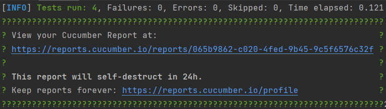

# spring-boot-ecommerce

Sample E-Commerce Implementation with Spring Boot and Angular.

The backend consist of REST APIs using Spring Web + Spring Data JPA, while front-end utilized Angular.

Includes tests using TestRestTemplate and Cucumber.

[//]: # (Data-driven using Excel, CSV, JSON file.)

[//]: # ([Github actions]&#40;https://github.com/kentdomaoal/restapi-testing-serenity-cucumber/actions&#41; were setup for its CI/CD Pipeline.)

---
## How to run in local machine

## 💻 *Pre-requisites*
- [](https://git-scm.com/downloads)
- [](https://www.oracle.com/ph/java/technologies/downloads) or higher
- [](https://maven.apache.org/download.cgi)

### Clone the project
```
git clone https://github.com/kentdomaoal/spring-boot-ecommerce.git
```
``` 
cd spring-boot-ecommerce
```
---
### Running the test
``` 
mvn clean install
``` 

### View html report
After test execution, you will see a section like this on your console.




Alternatively, Cucumber Report can be found on this directory on your project root.

      /target/cucumber-reports/Cucumber.html

---
### Running the Spring Boot application (Back-end REST APIs)
Assuming you are in the project root directory
```
mvn spring-boot:run
```


### Running the Angular application (Front-end)
Go to the directory of the angular application root
```
cd \src\main\js\ecommerce
```
```
npm start
```
